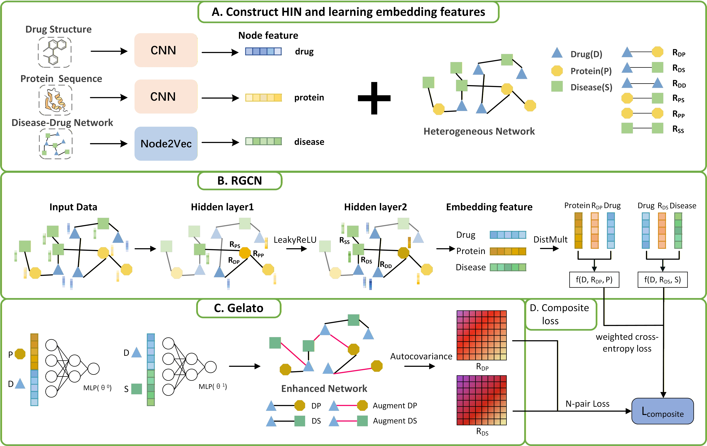

# RGGE-DTD: A Transformative Model for Simultaneous  Prediction of Drug-Target Interactions and Drug-Disease  Associations in Drug Repositioning

RGGE-DTD is a model based on RGCN and Gelato for predicting novel DTIs and DDAs.



# Requirements

The project is written in Python 3.10, and all experiments were conducted on a Windows server with an Intel 13th Gen Core i7-13700KF (3.44GHz, 64G RAM) and Nvidia RTX 4080s GPU (16G GPU RAM). For a faster training process, training on a GPU is necessary, but a standard computer without a GPU also works (though it will consume much more training time). We recommend the following hardware configuration:

```markdown
RAM= 16G
VRAM >= 16G
```

All implementations of RGGE-DTD are based on PyTorch and PyTorch Geometric. RGGE-DTD requires the following dependencies:

```markdown
python == 3.10.10
numpy == 1.24.3
pandas == 2.2.2
gensim==4.3.3
torch == 2.5.0+cu124
torchvision==0.20.0+cu124
torchaudio==2.5.0+cu124
torch_geometric == 2.6.1
```

# Code and data

## Code

- `hyperparameter.py` : includes all hyperparameters of the model
- `node2vec.py` : manually implemented node2vec algorithm
- `preprocess.py` : preprocessing functions calculate the preprocessed data that needs to be input into the model.
- `main.py` : predicting drug-target interaction and drug-disease association
- `util.py` : User-defined functions
- `model/RGGE.py` : RDTD Model Definition and Implementation
- `eval/evalRGGE.py` : Validation and testing functions for the model

## `Luo/`directory

- `drug.txt` : list of drug names
- `protein.txt` : list of protein names
- `disease.txt` : list of disease names
- `drug_smiles.csv` :Drug names and corresponding SMILES
- `protein_fasta.csv`  :Target UniProt ID and amino acid sequence
- `drug_dict_map.txt` : a complete ID mapping between drug names and DrugBank ID
- `protein_dict_map.txt` : a complete ID mapping between protein names and UniProt ID
- `drug_target.dat` : Index list and binary association scores of the Drug-Target interaction matrix
- `drug_dis.dat` : Index list and binary association scores of the Drug-Disease association matrix
- `drug_drug.dat` : Index list and binary association scores of the Drug-Drug interaction
- `protein_dis.dat` : Index list and binary association scores of the Protein-Disease association matrix
- `pro_pro.dat` : Index list and binary association scores of the Protein-Protein interaction matrix

## `predata/`directory

- `anc70.csv` : drug-drug interaction, target-target interaction, target-disease association, and disease-disease interaction with a threshold θ of 0.7. The edge indices corresponding to these four types of association data
- `key.csv` : drug-target interaction, drug-disease association. The edge indices corresponding to these two types of association data
- `smiles_sequences.npy` : SMILES sequences of drugs after dictionary encoding
- `pro_sequences.npy` : protein sequences in FASTA files after dictionary encoding
- `disease_feature.pt` : feature vector file of the disease

# Run RGGE-DTD

1. Obtain the preprocessing file and execute the following command.

```
python preprocess.py
```

Then we obtained the preprocessed files, all of which are stored in the `predata/` folder.

2. Run the RGGE-DTD model and execute the following command.

```
python main.py
```

Then we get the generated files, and the generated data is stored in the `results/` folder.

# Output Data

We will obtain the recorded data for each fold; taking fold 0 as an example.

`log0.txt` : recorded the loss values and AP metrics for the training and validation sets, and also recorded the AP, Hits@K, and Precision@K metrics for the test set.

`fold0DG.csv` : saved the true labels and predicted scores of DTI in the test set

`fold0DE.csv` : saved the true labels and predicted scores of DDA in the test set

# Contacts

If you have any questions or comments, please feel free to email Junrong Song(zz2144@ynufe.edu.cn).